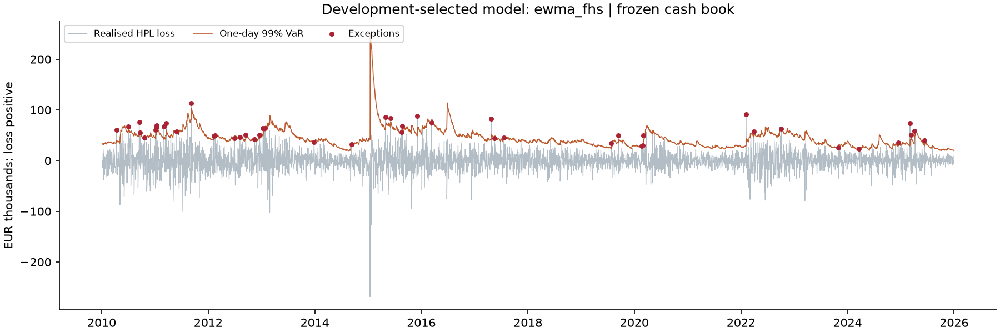
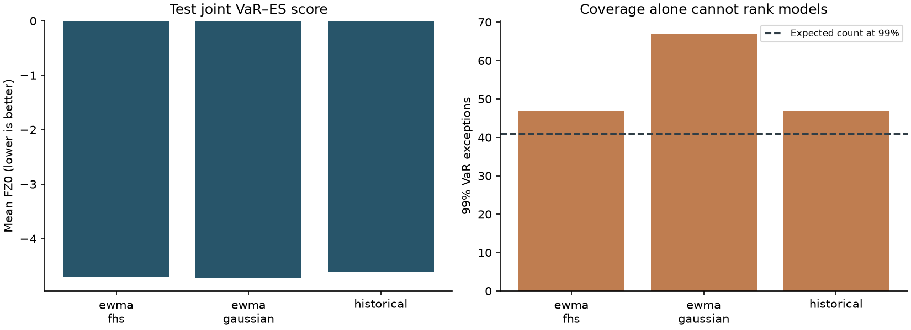
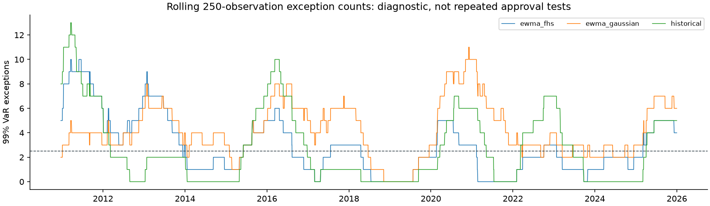
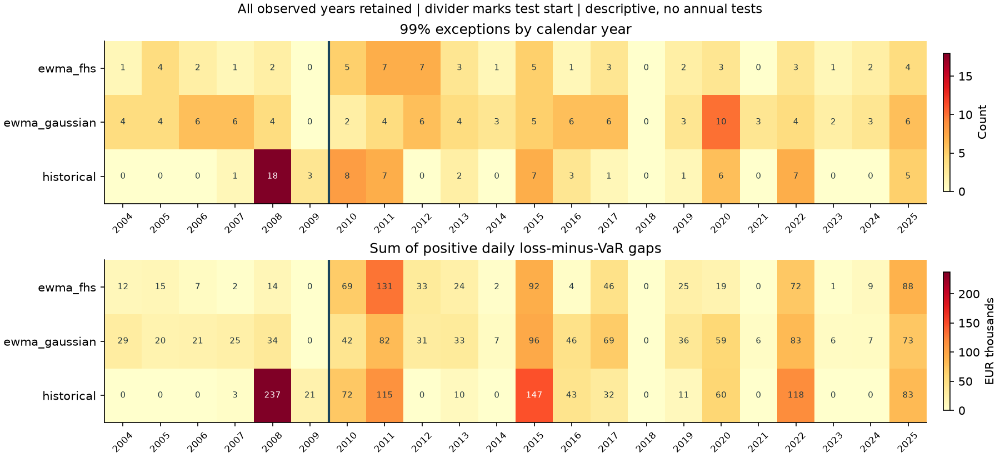
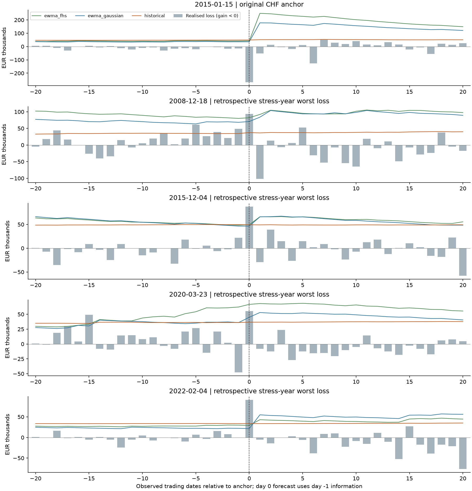

# Independent FX Market Risk Validation

## 1. Executive decision

The development-selected model is **ewma_fhs**. Its held-out statistical assessment is **not_rejected**. Selection uses development FZ0 only; the held-out sample does not choose the model.

This is a research validation decision, not a production approval. A non-rejected hypothesis does not establish correctness. Model rejection is a valid project outcome and must remain in the evidence.

### Concrete findings and use restrictions

**Gaussian tail coverage:** the held-out model produced 67 exceptions in 4,097 observations against 40.97 expected at 99% coverage (Holm-adjusted p = 0.002259; rejected). This is a frequency calibration finding, not a claim that the model forecasts the timing of every loss. A Gaussian tail combined with a volatility filter can leave material tail risk underrepresented; these observations alone do not isolate the causal mechanism.

**Scoring and calibration answer different questions:** Gaussian held-out FZ0 is -4.7257, lower (better) than the development-selected ewma_fhs's -4.7012, while its 99% coverage test is rejected. A good average joint score cannot replace a tail-coverage requirement, and the test-period score does not retrospectively change model selection.

**Historical-window response:** during 2008, historical simulation recorded 18 99% exceptions in 256 observations. Its equally weighted 1000-day window retains many pre-shock observations, a plausible mechanism for slow response to a volatility regime change. Concentrated stress-period exceptions are consistent with that explanation, not causal proof; development-period independence tests and the rolling plots provide separate diagnostic evidence. Shortening the window is an unproven candidate change, not an established improvement.

**Economic magnitude on 2022-02-04:** this was the largest observed loss within the predeclared 2022 calendar-year window. The day was identified retrospectively for explanation, not used to tune a model. A positive gap below is the amount by which realised loss exceeded that day's 99% VaR; it is not a claim about avoidable trading loss or required regulatory capital.

| Model | Realised loss EUR | 99% VaR EUR | Loss above VaR EUR |
| --- | --- | --- | --- |
| ewma_fhs | 90,990 | 29,230 | 61,760 |
| ewma_gaussian | 90,990 | 21,491 | 69,500 |
| historical | 90,990 | 33,757 | 57,234 |

**Use restriction:** this study does not support Gaussian VaR as stand-alone tail-risk approval evidence. Any restricted use needs independent stress and ES monitoring, with explicit attention to regime changes and forecast gaps. FHS and HS non-rejection also does not grant approval. A proposed tail model or window change must be a new version with new evidence; no improvement benefit has been demonstrated by the current experiment.

## 2. Data, portfolio and information set

Source period: **1999-01-04 to 2025-12-31**, 6,913 observed ECB dates. Data source: ECB reference rates. Derived returns and risk measures are this project's calculations.

Inception: **2004-01-02**; first realised HPL forecast: **2004-01-05**. The book starts with EUR 1,000,000 equivalent in each of USD, GBP, JPY, CHF and AUD; foreign units then remain fixed. There is no rebalancing or interest carry.

ECB quotes are foreign currency per EUR. EUR cash prices are their inverses. Exact next-day HPL is the fixed foreign quantity multiplied by the change in EUR cash price. All risk models use simple EUR cash-asset returns. The previous observed date is the forecast information date; no holiday filling or tail-event clipping occurs.

| Currency | Frozen foreign units |
| --- | --- |
| AUD | 1,668,300.0000 |
| CHF | 1,561,500.0000 |
| GBP | 705,450.0000 |
| JPY | 134,720,000.0000 |
| USD | 1,259,200.0000 |

## 3. Frozen model protocol

| Model | Specification |
| --- | --- |
| historical | Last 1000 joint asset-return vectors, equal scenario weights, exact cash repricing. |
| ewma_gaussian | Zero mean, EWMA covariance with lambda 0.94; analytical Gaussian VaR and ES. |
| ewma_fhs | Last 1000 joint vectors divided by their own prior-day EWMA volatilities, then rescaled to current prior-day volatility; no independent per-currency resampling. |

EWMA initializes from 250 prior returns. Inverse empirical-CDF VaR and probability-integrated upper-tail ES are used. Outputs are 97.5% VaR/ES and 99% VaR. Development ends 2009-12-31; held-out test begins 2010-01-01 and ends 2025-12-31.

## 4. Independent statistical validation

The validator reads frozen forecast rows, independently rebuilds inception allocations and daily cash HPL from source FX and frozen native quantities, and checks every model's information window. It verifies input, protocol and model-source hashes without calling the forecasting engines. A separate receipt binds the validation results, run manifest, predictions and validator source before reporting; this is an unsigned consistency check, not a digital signature. Exact two-sided binomial coverage tests and Clopper-Pearson intervals accompany Kupiec likelihood ratios. Christoffersen independence ratios use a conditional permutation reference distribution; asymptotic p-values are also retained for comparison.

ES uses the Acerbi–Szekely Z2 moment in loss convention, centered circular moving-block bootstrap with block length 20 and 5,000 draws. A positive moment indicates tail loss above forecast. This is an approximate weak-dependence/local-stability inference procedure, affected by VaR misspecification. Fewer than 20 realised tail events gives **insufficient evidence**.

Primary available coverage, independence and ES-underestimation hypotheses receive Holm correction separately within each split. Repeated 250-day windows and stress-year views are descriptive. They are not independent repeated approval tests.

FZ0 jointly scores 97.5% VaR and ES; pinball loss scores each VaR. Losses are normalized by inception gross notional, EUR 5m under the standard protocol. Lower scores are better; arbitrarily inflating VaR/ES does not earn a win merely by suppressing exceptions.

## 5. Observed results

### Development

| Model | n | 99% exceptions | Expected | FZ0 | ES moment | Assessment |
| --- | --- | --- | --- | --- | --- | --- |
| ewma_fhs | 1537 | 10 | 15.4 | -4.9702 | -0.4407 | not_rejected |
| ewma_gaussian | 1537 | 24 | 15.4 | -4.9661 | 0.3321 | not_rejected |
| historical | 1537 | 22 | 15.4 | -4.7131 | 0.2714 | rejected |

| Hypothesis | Raw p | Holm p | Reject at 5% |
| --- | --- | --- | --- |
| ewma_fhs/es_975/underestimation | 1.0000 | 1.0000 | no |
| ewma_fhs/var_975/coverage | 0.0053 | 0.0690 | no |
| ewma_fhs/var_975/independence | 0.9792 | 1.0000 | no |
| ewma_fhs/var_99/coverage | 0.1987 | 1.0000 | no |
| ewma_fhs/var_99/independence | 0.9880 | 1.0000 | no |
| ewma_gaussian/es_975/underestimation | 0.0372 | 0.4463 | no |
| ewma_gaussian/var_975/coverage | 0.0860 | 0.8601 | no |
| ewma_gaussian/var_975/independence | 0.2052 | 1.0000 | no |
| ewma_gaussian/var_99/coverage | 0.0384 | 0.4463 | no |
| ewma_gaussian/var_99/independence | 0.7343 | 1.0000 | no |
| historical/es_975/underestimation | 0.2096 | 1.0000 | no |
| historical/var_975/coverage | 0.2872 | 1.0000 | no |
| historical/var_975/independence | 0.0002 | 0.0030 | yes |
| historical/var_99/coverage | 0.0943 | 0.8601 | no |
| historical/var_99/independence | 0.0004 | 0.0056 | yes |

- ewma_fhs: ES tail events 22; ES evidence available; approximate 95% moment interval [-0.6559, -0.2116]. Mean 99% VaR EUR 40,046; mean 97.5% ES EUR 40,829.

- ewma_gaussian: ES tail events 49; ES evidence available; approximate 95% moment interval [-0.0172, 0.6987]. Mean 99% VaR EUR 33,755; mean 97.5% ES EUR 33,921.

- historical: ES tail events 45; ES evidence available; approximate 95% moment interval [-0.3270, 1.0446]. Mean 99% VaR EUR 37,939; mean 97.5% ES EUR 39,291.

### Test

| Model | n | 99% exceptions | Expected | FZ0 | ES moment | Assessment |
| --- | --- | --- | --- | --- | --- | --- |
| ewma_fhs | 4097 | 47 | 41.0 | -4.7012 | 0.0503 | not_rejected |
| ewma_gaussian | 4097 | 67 | 41.0 | -4.7257 | 0.2632 | rejected |
| historical | 4097 | 47 | 41.0 | -4.6096 | -0.0150 | not_rejected |

| Hypothesis | Raw p | Holm p | Reject at 5% |
| --- | --- | --- | --- |
| ewma_fhs/es_975/underestimation | 0.3211 | 1.0000 | no |
| ewma_fhs/var_975/coverage | 0.7641 | 1.0000 | no |
| ewma_fhs/var_975/independence | 0.1816 | 1.0000 | no |
| ewma_fhs/var_99/coverage | 0.3451 | 1.0000 | no |
| ewma_fhs/var_99/independence | 1.0000 | 1.0000 | no |
| ewma_gaussian/es_975/underestimation | 0.0162 | 0.1950 | no |
| ewma_gaussian/var_975/coverage | 0.2106 | 1.0000 | no |
| ewma_gaussian/var_975/independence | 0.9898 | 1.0000 | no |
| ewma_gaussian/var_99/coverage | 0.0002 | 0.0023 | yes |
| ewma_gaussian/var_99/independence | 0.4077 | 1.0000 | no |
| historical/es_975/underestimation | 0.5489 | 1.0000 | no |
| historical/var_975/coverage | 0.7260 | 1.0000 | no |
| historical/var_975/independence | 0.0074 | 0.1036 | no |
| historical/var_99/coverage | 0.3451 | 1.0000 | no |
| historical/var_99/independence | 0.0150 | 0.1950 | no |

- ewma_fhs: ES tail events 105; ES evidence available; approximate 95% moment interval [-0.1702, 0.2822]. Mean 99% VaR EUR 44,416; mean 97.5% ES EUR 46,757.

- ewma_gaussian: ES tail events 115; ES evidence available; approximate 95% moment interval [0.0332, 0.5040]. Mean 99% VaR EUR 40,893; mean 97.5% ES EUR 41,094.

- historical: ES tail events 98; ES evidence available; approximate 95% moment interval [-0.2484, 0.2272]. Mean 99% VaR EUR 47,336; mean 97.5% ES EUR 49,521.

## 6. Visual diagnostics

## 7. Predeclared stress years

Full calendar years 2008, 2015, 2020 and 2022 are shown without significance claims. 2008 belongs to development; later stress years belong to the held-out sample. Worst days below are descriptive observations, not new tuning targets.

| Year | Model | 99% hits / n | Worst date | Worst loss EUR | VaR on that day EUR |
| --- | --- | --- | --- | --- | --- |
| 2008 | ewma_fhs | 2 / 256 | 2008-12-18 | 93,876 | 82,041 |
| 2008 | ewma_gaussian | 4 / 256 | 2008-12-18 | 93,876 | 70,711 |
| 2008 | historical | 18 / 256 | 2008-12-18 | 93,876 | 37,451 |
| 2015 | ewma_fhs | 5 / 256 | 2015-12-04 | 87,379 | 49,408 |
| 2015 | ewma_gaussian | 5 / 256 | 2015-12-04 | 87,379 | 46,485 |
| 2015 | historical | 7 / 256 | 2015-12-04 | 87,379 | 49,291 |
| 2020 | ewma_fhs | 3 / 257 | 2020-03-23 | 55,430 | 66,645 |
| 2020 | ewma_gaussian | 10 / 257 | 2020-03-23 | 55,430 | 44,939 |
| 2020 | historical | 6 / 257 | 2020-03-23 | 55,430 | 36,686 |
| 2022 | ewma_fhs | 3 / 257 | 2022-02-04 | 90,990 | 29,230 |
| 2022 | ewma_gaussian | 4 / 257 | 2022-02-04 | 90,990 | 21,491 |
| 2022 | historical | 7 / 257 | 2022-02-04 | 90,990 | 33,757 |

### Signed CHF event replay

The predeclared 14–16 January 2015 window is distinct from the worst loss in all of 2015. Positive HPL is a gain. In particular, a long CHF cash exposure can gain on the floor-removal day; no gain is relabeled as a loss.

| Date | Model | Signed HPL EUR | 99% VaR EUR | Loss exception |
| --- | --- | --- | --- | --- |
| 2015-01-14 | historical | 14,326 | 48,921 | no |
| 2015-01-14 | ewma_gaussian | 14,326 | 35,821 | no |
| 2015-01-14 | ewma_fhs | 14,326 | 41,509 | no |
| 2015-01-15 | historical | 268,605 | 49,189 | no |
| 2015-01-15 | ewma_gaussian | 268,605 | 35,822 | no |
| 2015-01-15 | ewma_fhs | 268,605 | 42,704 | no |
| 2015-01-16 | historical | 51,034 | 51,279 | no |
| 2015-01-16 | ewma_gaussian | 51,034 | 178,004 | no |
| 2015-01-16 | ewma_fhs | 51,034 | 249,471 | no |

### Post-review calendar-year diagnostics

These additions inspect the existing sample after its original results were reviewed. They do not create a fresh holdout, change model selection, or add significance tests. Every observed calendar year is retained in data/annual.csv and the annual heatmap; the compact table below shows all test years. Cells are **99% exception count / sum of positive loss-minus-VaR gaps in EUR thousands**. At nominal coverage, expected count is n × 1%; a large count in a short year is diagnostic evidence, not an independent rejection decision.

| Year | n | ewma_fhs | ewma_gaussian | historical |
| --- | --- | --- | --- | --- |
| 2010 | 258 | 5 / 69.2 | 2 / 41.7 | 8 / 72.1 |
| 2011 | 257 | 7 / 130.5 | 4 / 82.5 | 7 / 114.7 |
| 2012 | 256 | 7 / 33.0 | 6 / 30.5 | 0 / 0.0 |
| 2013 | 255 | 3 / 24.3 | 4 / 32.6 | 2 / 9.5 |
| 2014 | 255 | 1 / 2.2 | 3 / 6.7 | 0 / 0.0 |
| 2015 | 256 | 5 / 92.1 | 5 / 96.2 | 7 / 146.9 |
| 2016 | 257 | 1 / 3.5 | 6 / 46.0 | 3 / 43.0 |
| 2017 | 255 | 3 / 45.6 | 6 / 69.2 | 1 / 32.1 |
| 2018 | 255 | 0 / 0.0 | 0 / 0.0 | 0 / 0.0 |
| 2019 | 255 | 2 / 24.7 | 3 / 36.4 | 1 / 10.5 |
| 2020 | 257 | 3 / 18.7 | 10 / 59.1 | 6 / 60.3 |
| 2021 | 258 | 0 / 0.0 | 3 / 5.5 | 0 / 0.0 |
| 2022 | 257 | 3 / 72.2 | 4 / 83.4 | 7 / 118.1 |
| 2023 | 255 | 1 / 1.2 | 2 / 5.8 | 0 / 0.0 |
| 2024 | 256 | 2 / 9.0 | 3 / 6.6 | 0 / 0.0 |
| 2025 | 255 | 4 / 88.1 | 6 / 72.8 | 5 / 82.6 |

- ewma_fhs: its highest-count test year is 2011 with 7 / 257 exceptions (expected 2.57); positive daily VaR gaps total EUR 130,540. 16 of 16 test years have fewer than 20 ES tail observations. No annual ES inference is performed, including years that reach that count threshold.

- ewma_gaussian: its highest-count test year is 2020 with 10 / 257 exceptions (expected 2.57); positive daily VaR gaps total EUR 59,121. 16 of 16 test years have fewer than 20 ES tail observations. No annual ES inference is performed, including years that reach that count threshold.

- historical: its highest-count test year is 2010 with 8 / 258 exceptions (expected 2.58); positive daily VaR gaps total EUR 72,078. 15 of 16 test years have fewer than 20 ES tail observations. No annual ES inference is performed, including years that reach that count threshold.

### Event response and cash attribution

A ±20-observation replay separates the forecast available before the anchor from the next forecast, which can use the anchor return. The original CHF date is retained; the other anchors are **retrospectively selected worst-loss dates** within the four original stress years. They are explanatory case studies, not successful advance event predictions. Boundary windows disclose their actual pre/post counts in data/event_responses.csv. All event-day currency HPL contributions are exported in data/currency_hpl.csv; these are cash accounting contributions, not marginal VaR or causal effects.

| Anchor / selection | Model | Anchor VaR EUR | Next VaR EUR | Next / anchor | Pre → post mean VaR EUR | Post hits / n |
| --- | --- | --- | --- | --- | --- | --- |
| 2015-01-15 (CHF) | ewma_fhs | 42,704 | 249471 | 5.84 | 41013 → 198523 | 0 / 20 |
| 2015-01-15 (CHF) | ewma_gaussian | 35,822 | 178004 | 4.97 | 35686 → 151091 | 0 / 20 |
| 2015-01-15 (CHF) | historical | 49,189 | 51279 | 1.04 | 47783 → 51443 | 0 / 20 |
| 2008-12-18 (retrospective worst loss) | ewma_fhs | 82,041 | 91934 | 1.12 | 90537 → 99500 | 0 / 20 |
| 2008-12-18 (retrospective worst loss) | ewma_gaussian | 70,711 | 83829 | 1.19 | 70585 → 95726 | 0 / 20 |
| 2008-12-18 (retrospective worst loss) | historical | 37,451 | 36429 | 0.97 | 34590 → 38350 | 1 / 20 |
| 2015-12-04 (retrospective worst loss) | ewma_fhs | 49,408 | 66133 | 1.34 | 55703 → 59927 | 0 / 20 |
| 2015-12-04 (retrospective worst loss) | ewma_gaussian | 46,485 | 65923 | 1.42 | 56093 → 57679 | 0 / 20 |
| 2015-12-04 (retrospective worst loss) | historical | 49,291 | 49082 | 1.00 | 49189 → 48969 | 0 / 20 |
| 2020-03-23 (retrospective worst loss) | ewma_fhs | 66,645 | 68063 | 1.02 | 43613 → 63315 | 0 / 20 |
| 2020-03-23 (retrospective worst loss) | ewma_gaussian | 44,939 | 52989 | 1.18 | 34346 → 47727 | 0 / 20 |
| 2020-03-23 (retrospective worst loss) | historical | 36,686 | 36725 | 1.00 | 35851 → 37265 | 0 / 20 |
| 2022-02-04 (retrospective worst loss) | ewma_fhs | 29,230 | 43079 | 1.47 | 27629 → 41305 | 0 / 20 |
| 2022-02-04 (retrospective worst loss) | ewma_gaussian | 21,491 | 54954 | 2.56 | 22978 → 51620 | 0 / 20 |
| 2022-02-04 (retrospective worst loss) | historical | 33,757 | 33666 | 1.00 | 33747 → 34189 | 0 / 20 |

**CHF accounting and timing:** signed portfolio HPL on 2015-01-15 was EUR +268,605. The table below sums to that portfolio HPL. A gain can still increase a two-sided volatility estimate and the next loss-tail forecast. That response was unavailable before the anchor and does not show that the gain needed a VaR loss buffer.

| Currency | Signed HPL EUR |
| --- | --- |
| AUD | +26,896 |
| CHF | +218,802 |
| GBP | +9,607 |
| JPY | +7,180 |
| USD | +6,120 |

**Economic interpretation:** more risk buffer after an event can reduce subsequent exceptions but can also remain elevated after realised volatility falls. These plots show the timing and magnitude; they do not estimate optimal capital, trading P&L saved, or the causal benefit of a model change. The sign, observation calendar and frozen holdings remain essential to interpretation. Any proposed adaptation requires a new model version and genuinely new evaluation evidence.

## 8. Limitations and follow-up

- Public reference-rate hypothetical P&L; no actual trading, bid/ask, funding or liquidity cost.

- No result is regulatory approval; non-rejection is not proof of a correct model.

- Long samples can hide regime-specific failures; short regimes have weak test power.

- Z2 bootstrap is approximate; a wrong VaR can distort the ES diagnostic.

- All model comparisons reuse the same fixed book; this does not demonstrate universal superiority.

- Fixed long cash exposures do not establish performance for options, leveraged trading, dynamic hedging or funding-sensitive portfolios. Gaussian support and FHS volatility scaling are modeling assumptions.

- Reference rates are not executable prices. There are no transaction-cost, liquidity-horizon, FRTB capital or production-control claims.

- A rejection requires investigating the pattern and economic cause. A changed specification requires a new version and fresh holdout; the current test period cannot be recycled as independent evidence.

## 9. Provenance and reproduction

Data SHA-256: `45b2a3fbfe4150345b1e150519ce9f9bc21d2cfa3a2262586cf7274f2490604e`

Protocol SHA-256: `e1aa690600e83dff3ff80ee1b29595ea407ec04382d0847faa1eb52f98fffcda`

Model-source SHA-256: `f9e620eaae9850bdd14cc82415bdf931f0dc3700a87c9a62b6add707c9b278f1`

Predictions SHA-256: `4d3b8a83534f21a2cda221d7003eb8ca73185563c2e9a3b42fa802f6142e451a`

Validation SHA-256: `429f4f3f8bb6711776d81eaaf745a2a0fd5f53941ab477f82ba51f45cdd0813b`

Validator-source SHA-256: `ce76ff3b3992fbcbf15ec6cc41c9569bc839ca108ea613dc4bc9f65b8bae0005`

Frozen run time UTC: `2026-09-20T09:15:42.923951+00:00`. Validation seed: `42`. See run_manifest.json, protocol.json, holdings.json, predictions.csv and validation.json for machine-readable evidence.

## 10. Management summary and interview notes / 管理摘要与面试说明

开发期按联合评分选出 ewma_fhs；封存测试给出的结论为 not_rejected。这不是上线批准，也不是模型正确性的证明。应结合尾部损失、超越聚集、统计不确定性和风险预测成本判断用途。

面试重点：先说明现金头寸与价格口径，再解释为何不能随机拆分时间序列、为何历史波动率必须只使用当时已有信息，以及为何通过VaR覆盖检验仍可能低估ES。

项目的价值在于可复核的判断链：官方真实数据 → 冻结协议和预测 → 独立验证 → 反例与限制。模型被拒绝应如实报告；把VaR放大到没有超越并不是改进。

## 11. Method sources

ECB reference rates: https://www.ecb.europa.eu/stats/policy_and_exchange_rates/euro_reference_exchange_rates/html/index.en.html

Acerbi and Szekely (2014), Backtesting Expected Shortfall: https://www.msci.com/resources/research/articles/2014/Research_Insight_Backtesting_Expected_Shortfall_December_2014.pdf

Patton, Ziegel and Chen (2019), equation 6, FZ0: https://public.econ.duke.edu/~ap172/Patton_Ziegel_Chen_JoE_2019.pdf
