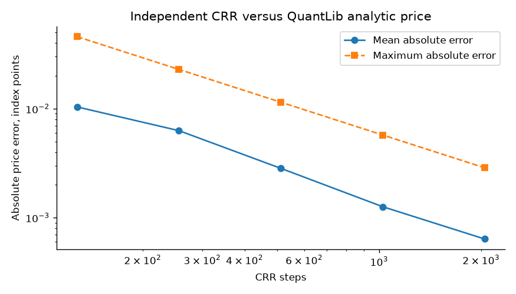
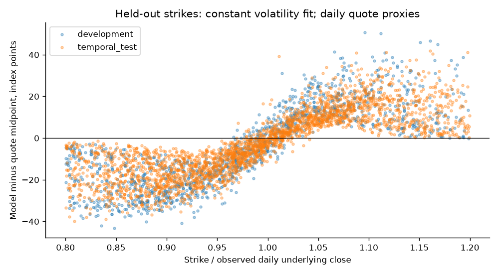
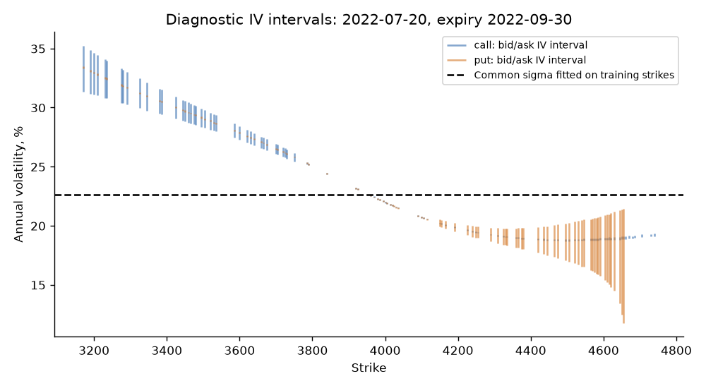
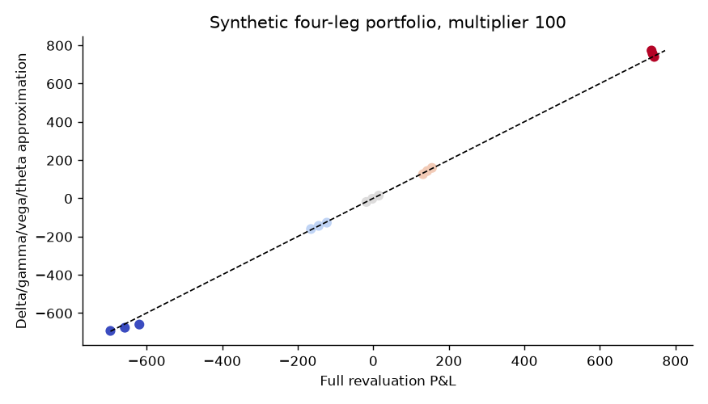
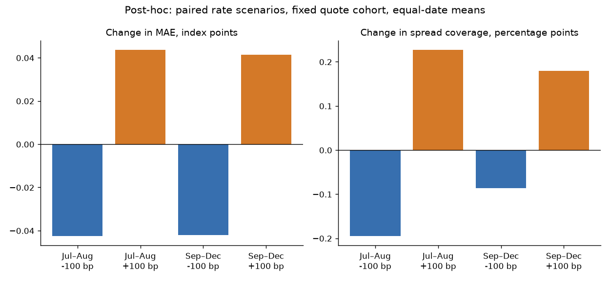
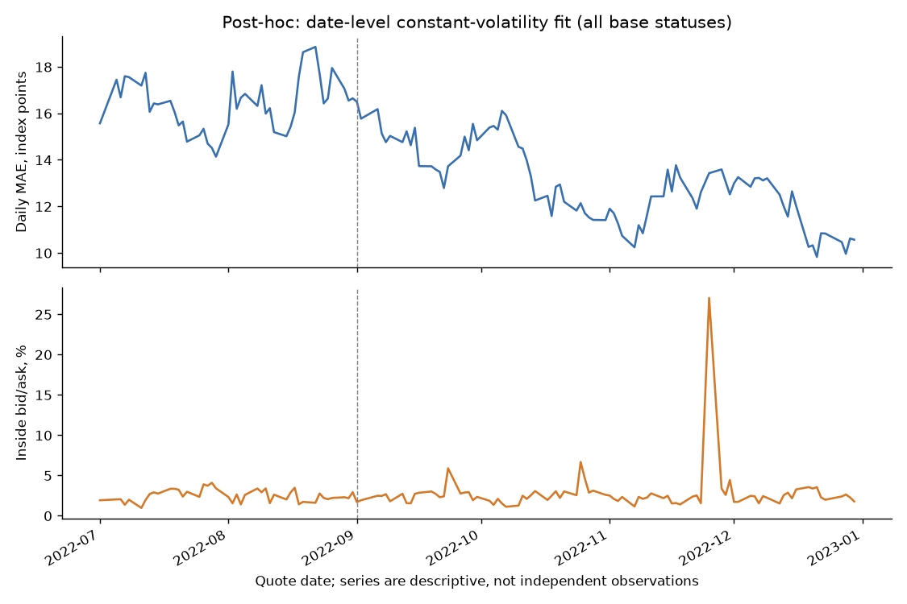
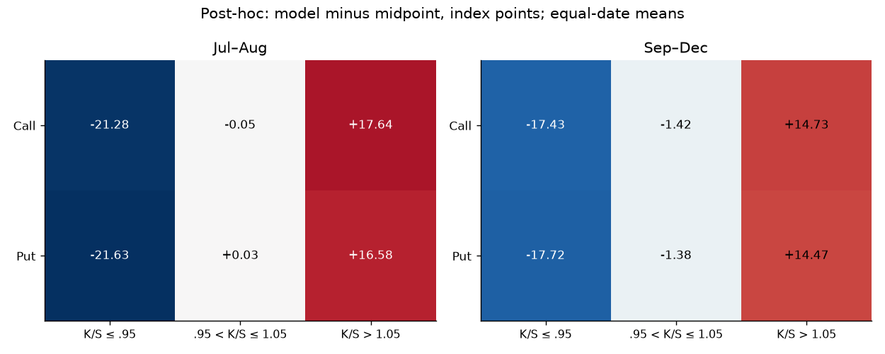

# European index option pricing — independent validation

**Software validation: PASS. Market reliability: not established.**

This study separates external numerical agreement from the suitability of constant-volatility pricing on a limited historical quote slice. No acceptance claim is made for a trading or production pricing model.

Protocol chronology: rules were specified in implementation before the first full historical execution; this document was consolidated afterwards and validator/report defects were corrected after inspection. September–December is a retrospective fixed-protocol evaluation, not a freshly untouched prospective holdout.

## Executive findings

- Frozen numerical cases checked: 348; maximum analytic price difference from QuantLib: 4.26e-14 index points.
- Independent validation failures: 0. Full evidence is in `validation.json`; no failure is removed from the report.
- Base-rate date/expiry groups: 1603; statuses: {'EXPLORATORY_INCONSISTENT_QUOTES': 15, 'PARITY_COMPATIBLE_DAILY_PROXY': 1588}.
- Parity-compatible daily quotes remain daily proxies. Inconsistent groups retain explicitly exploratory forward estimates and are reported separately.
- A single implied volatility per contract is an inverse price diagnostic. Only a common volatility fitted on training strikes is evaluated on held-out strikes.

## Scope, data and information boundaries

SPXW European PM-settled vanilla calls/puts, 30–180 calendar days, K/S in [0.8, 1.2], positive bid, uncrossed quotes, relative spread at most 15%. Quote-time absence and asynchronous closing snapshots are explicit limitations. ACT/365F date differences approximate end-of-day maturity time.

July–August 2022 is development; September–December is the frozen temporal-protocol test. Each date/expiry still recalibrates using its contemporaneous training strikes. This is a cross-strike fit assessment, not a future-price forecast. The SHA-256 assignment keeps each strike's call and put together (70% train buckets / 30% holdout buckets).

Discounting uses the latest strictly prior-date DGS3MO observation, at most seven calendar days old. This historical 3-month Treasury rate is a flat discount proxy, not an OIS or zero-coupon curve. Forward and common volatility are reconstructed from training quotes for each of base, −100 bp and +100 bp rate assumptions.

Source rows: 4,294,301; rows surviving predeclared eligibility: 558,506; excluded: 3,735,795. `ingest_exclusions.csv` records every rejected row and reason; `groups.json` records every calibration rejection and parity conflict.

## Numerical validation and approximation risk

BSM analytic prices and spot Greeks are compared with QuantLib AnalyticEuropeanEngine on fixed complete-input cases. CRR independently sums binomial terminal payoffs at 128–2048 steps. Both numerical engines share lognormal-model assumptions; agreement does not validate those economic assumptions. Price, delta, gamma, vega, theta and rho units and tolerances are frozen in `PROTOCOL.md`.

Expired/zero-volatility payoffs have explicit deterministic limits and nonregular Greek statuses. IV inversion rejects impossible prices and flags low-vega conditioning. The synthetic four-leg shock experiment measures approximation error against full revaluation, independently recomputed with QuantLib; it is not a historical hedging backtest.

## Held-out quote findings

| Period | Parity status | Quotes | Dates | Inside bid/ask | MAE (points) | RMSE (points) |
| --- | --- | --- | --- | --- | --- | --- |
| Jul–Aug | Exploratory inconsistent | 1286 | 10 | 0.62% | 25.083 | 27.903 |
| Jul–Aug | Compatible daily proxy | 55610 | 43 | 2.54% | 16.193 | 18.807 |
| Sep–Dec | Exploratory inconsistent | 234 | 2 | 0.43% | 20.942 | 23.871 |
| Sep–Dec | Compatible daily proxy | 111319 | 84 | 2.73% | 12.92 | 15.309 |

Coverage is the fraction of held-out model prices inside the observed bid/ask interval. Observations cluster by date and expiry; raw counts are not independent sample sizes. No minimum coverage target is retrofitted to the observations.

### Discount-proxy sensitivity (forward and volatility refitted on training strikes)

The next legacy table groups each rate scenario by its own parity status. Membership can change across rows; subtracting its MAE values is not a matched rate effect. It is retained as a composition description. The fixed-cohort post-hoc comparison follows below.

| Period | Parity status | Rate shift | Quotes | Inside bid/ask | MAE (points) |
| --- | --- | --- | --- | --- | --- |
| Jul–Aug | Exploratory inconsistent | -100 bp | 21245 | 0.84% | 22.412 |
| Jul–Aug | Exploratory inconsistent | +0 bp | 1286 | 0.62% | 25.083 |
| Jul–Aug | Exploratory inconsistent | +100 bp | 740 | 1.89% | 14.512 |
| Jul–Aug | Compatible daily proxy | -100 bp | 35651 | 3.16% | 12.741 |
| Jul–Aug | Compatible daily proxy | +0 bp | 55610 | 2.54% | 16.193 |
| Jul–Aug | Compatible daily proxy | +100 bp | 56156 | 2.74% | 16.462 |
| Sep–Dec | Exploratory inconsistent | -100 bp | 34902 | 1.04% | 18.336 |
| Sep–Dec | Exploratory inconsistent | +0 bp | 234 | 0.43% | 20.942 |
| Sep–Dec | Exploratory inconsistent | +100 bp | 296 | 1.69% | 16.997 |
| Sep–Dec | Compatible daily proxy | -100 bp | 76651 | 3.37% | 10.417 |
| Sep–Dec | Compatible daily proxy | +0 bp | 111319 | 2.73% | 12.92 |
| Sep–Dec | Compatible daily proxy | +100 bp | 111257 | 2.91% | 12.968 |

### Calibration rejections

No groups rejected by the calibration eligibility rules; exploratory inconsistency statuses are retained separately.

## Post-hoc descriptive diagnostics

These diagnostics were selected after reviewing the original results. They preserve every original model, cleaning rule, fitted parameter and prediction. No p-values, confidence intervals, new holdout or tuning claim is added.

The paired rate cohort has 168,449 exact held-out quote IDs across 1,603 date/expiry groups and 127 dates. Excluded base quotes missing a scenario: 0. Each comparison uses these same IDs and fixed **base-rate** status strata; changed alternative statuses are reported as outcomes.

### Matched rate changes on a fixed cohort

| Period | Rate shift | Matched quotes | Matched groups | Quote mean change in MAE (points) | Daily mean change in MAE (points) | Group mean change in MAE (points) | Quote mean coverage change (pp) | Daily mean coverage change (pp) |
| --- | --- | --- | --- | --- | --- | --- | --- | --- |
| Jul–Aug | -100 bp | 56896 | 497 | -0.041644 | -0.042605 | -0.044395 | -0.19861 | -0.19537 |
| Sep–Dec | -100 bp | 111553 | 1106 | -0.042235 | -0.041994 | -0.042186 | -0.085161 | -0.08624 |
| Jul–Aug | +100 bp | 56896 | 497 | 0.042228 | 0.043555 | 0.047277 | 0.232 | 0.22658 |
| Sep–Dec | +100 bp | 111553 | 1106 | 0.041624 | 0.041453 | 0.042518 | 0.1757 | 0.17918 |

A delta is shifted minus base. Forward and common volatility were refitted on training strikes in each original rate scenario. These are differences between full recalibrated assumptions, not partial rho and not causal interest-rate effects. The JSON also contains fixed baseline-status strata, status transitions and a per-date paired table.

Only changed status memberships are listed below; they remain in the matched analysis under their base status. Counts are date/expiry groups, not independent samples.

| Period | Rate shift | Base parity status | Shifted parity status | Groups | Quotes |
| --- | --- | --- | --- | --- | --- |
| Jul–Aug | -100 bp | Compatible daily proxy | Exploratory inconsistent | 188 | 19959 |
| Sep–Dec | -100 bp | Compatible daily proxy | Exploratory inconsistent | 341 | 34668 |
| Jul–Aug | +100 bp | Exploratory inconsistent | Compatible daily proxy | 13 | 1286 |
| Jul–Aug | +100 bp | Compatible daily proxy | Exploratory inconsistent | 5 | 740 |
| Sep–Dec | +100 bp | Exploratory inconsistent | Compatible daily proxy | 2 | 234 |
| Sep–Dec | +100 bp | Compatible daily proxy | Exploratory inconsistent | 3 | 296 |

### How observation weighting changes the descriptive result

| Period | Quotes | Dates | Groups | MAE (points) | Daily mean MAE (points) | Group mean MAE (points) | Inside bid/ask | Daily mean inside bid/ask |
| --- | --- | --- | --- | --- | --- | --- | --- | --- |
| Jul–Aug | 56896 | 43 | 497 | 16.394 | 16.401 | 16.395 | 2.49% | 2.49% |
| Sep–Dec | 111553 | 84 | 1106 | 12.937 | 12.978 | 12.435 | 2.73% | 2.74% |

Quote-weighted means give more influence to dates with more quotes. Equal-date means first aggregate each date; equal-group means first aggregate each date/expiry. These are different descriptive estimands and do not make correlated quotes independent. Call/put × moneyness slices and daily series show where signed pricing errors concentrate without treating every quote as an independent trial.

### September–December call/put and strike patterns

| Option type | Strike / daily spot | Quotes | Dates | Daily mean signed error (points) | Daily mean MAE (points) | Daily mean inside bid/ask |
| --- | --- | --- | --- | --- | --- | --- |
| call | K/S<=0.95 | 20520 | 84 | -17.434 | 17.436 | 1.48% |
| call | 0.95<K/S<=1.05 | 19736 | 84 | -1.4163 | 7.3171 | 4.18% |
| call | K/S>1.05 | 15265 | 84 | 14.731 | 14.731 | 0.00% |
| put | K/S<=0.95 | 20512 | 84 | -17.723 | 17.725 | 0.01% |
| put | 0.95<K/S<=1.05 | 19727 | 84 | -1.3833 | 7.3814 | 3.62% |
| put | K/S>1.05 | 15793 | 84 | 14.468 | 14.472 | 7.80% |

Positive signed error means model above quote midpoint. A repeated change in error sign across strikes is compatible with a constant-volatility specification missing market skew. This descriptive pattern does not isolate model dynamics from asynchronous quotes, forward reconstruction or discount-proxy errors. The near-spot band is K/S-based, not a forward-delta bucket; call/put slices can have different quote membership after the unchanged eligibility rules.

## Limitations, findings and recommendations

- End-of-day bid/ask and underlying close are not proven synchronous; missing quote_time is retained as an explicit limitation.
- Numerical engine agreement validates implementation under shared lognormal assumptions, not economic model truth.
- Per-contract implied volatility is diagnostic inversion, never held-out model performance.
- Quote observations cluster by date and expiry; counts are not independent population evidence.
- No Heston, American exercise, live surface, tradable-arbitrage claim, or out-of-sample hedging claim.
- Treat Treasury-proxy and timestamp uncertainty as model-input risk; do not present exploratory parity reconciliation as a verified market calibration.
- Constant volatility may fit some strikes poorly even when the pricing code is correct. Preserve the negative evidence and bid/ask uncertainty before considering richer dynamics.
- Heston, a live market surface, American exercise, transaction-cost hedging, and derivative VaR integration are outside this study.

## Independent validation failures

No unresolved automated validation findings.

## Figures

### CRR convergence

### Held-out price errors

### Quote IV intervals are diagnostics, not held-out predictions

### Synthetic portfolio shocks

### Post-hoc matched rate sensitivity; refitted F and sigma, no causal claim

### Post-hoc daily fit diagnostics; no IID confidence interval

### Post-hoc call/put and moneyness bias; positive means model above midpoint

## Reproduction and immutable evidence

Run `option-validation ingest`, `run`, `validate`, `diagnose`, then `report` with the same `--output` directory. The validator reads frozen outputs, verifies file hashes, uses QuantLib independently, audits rate availability and paired train/holdout membership, and reconstructs training forwards/objectives. Provider IV and Greeks are never an oracle.

Results SHA-256: `269c41ea1595ce32f1f542dee27580371f8f0715a425ac06daea47b1db7a1673`. QuantLib version: `1.43`. Detailed predictions, exclusions, parameter choices, and failures remain beside this report.
